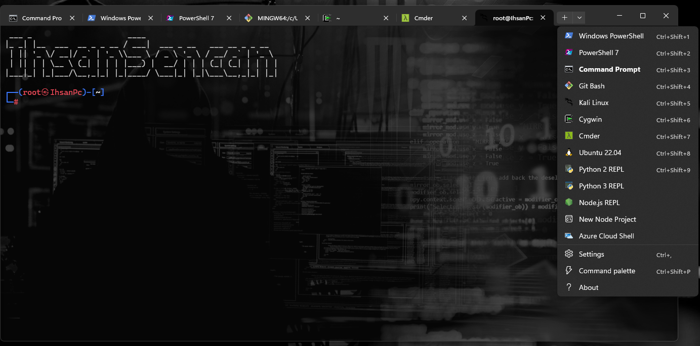
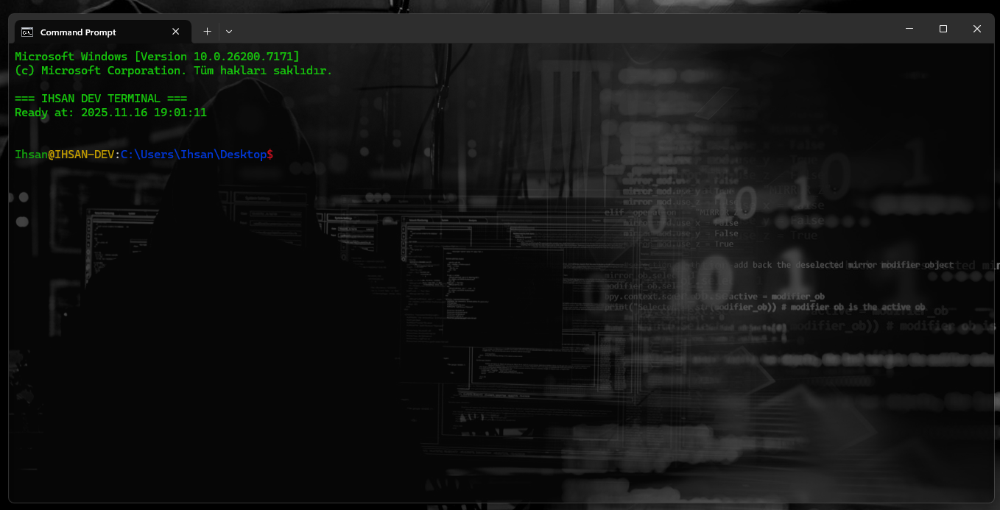
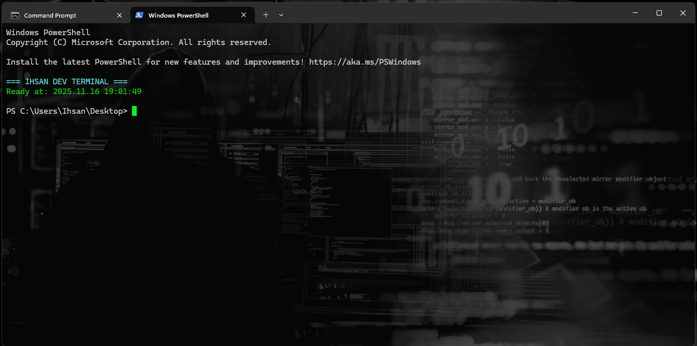
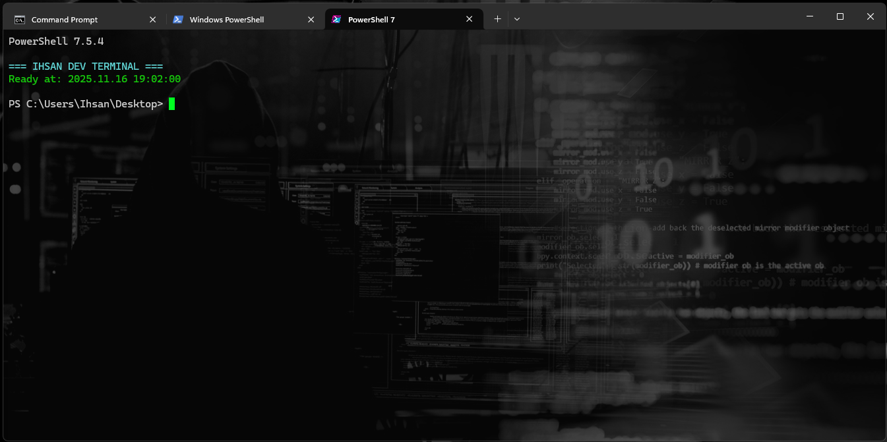
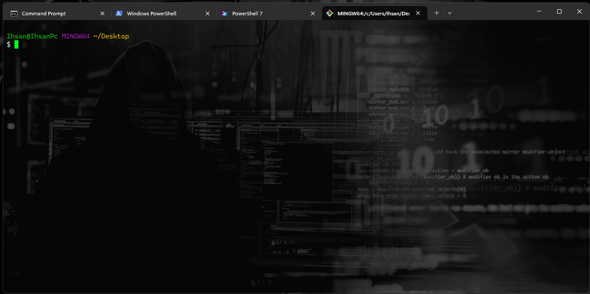
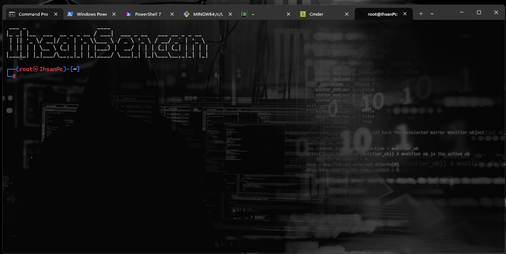
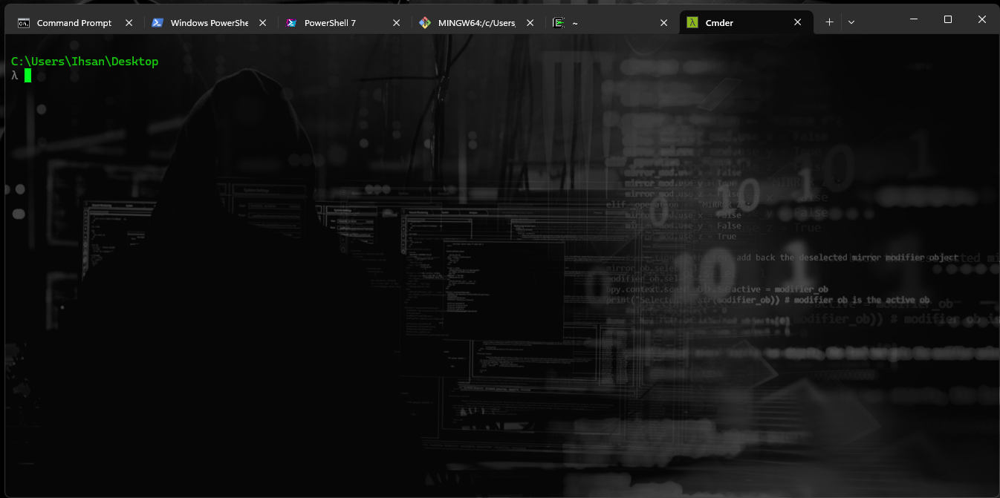
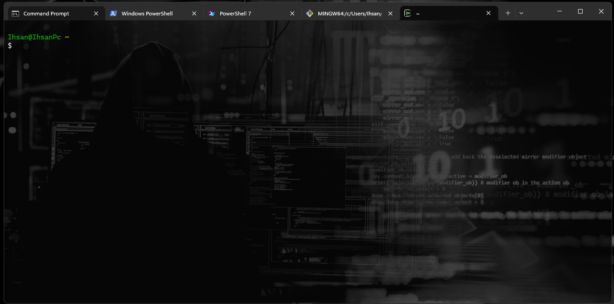

# 🖥️ Ultimate Windows Terminal Setup

> Professional terminal configuration with 12 profiles and productivity enhancements


## 🎮 Demo

### Main Interface


### Profiles Showcase

| Command Prompt | PowerShell | PowerShell 7 |
|----------------|------------|--------------|
|  |  |  |

| Git Bash | Kali Linux | Cmder |
|----------|------------|-------|
|  |  |  |

| Cygwin |
|--------|
|  |

## ✨ Features

- 🎨 **12 Terminal Profiles** - PowerShell, CMD, WSL, Git Bash, Kali Linux
- ⌨️ **Productivity Shortcuts** - Optimized keybindings for faster workflow
- 🖼️ **Custom Backgrounds** - Personalize your terminal experience
- 🐧 **WSL Integration** - Kali Linux and Ubuntu support
- ⚡ **PowerShell Profiles** - Custom profiles for PS 5.1 and PS 7
- 🛠️ **Developer-Friendly** - Ready-to-use setup

## 🚀 Quick Install

```bash
# Clone repository
git clone https://github.com/ihsansencan/Windows-Terminal-Setup.git
cd Windows-Terminal-Setup

# Run automated installer
install.bat
```

Restart Windows Terminal and enjoy! 🎉

## 🎯 Profiles Included

- **Command Prompt (IHSAN DEV)** - Custom styled CMD with enhanced features
- **PowerShell** - Windows PowerShell 5.1 with custom profile
- **PowerShell 7** - Cross-platform PowerShell with custom profile
- **Git Bash** - Git for Windows BASH environment
- **Kali Linux** - Penetration testing and security tools
- **Ubuntu** - Popular Linux distribution via WSL
- **Cygwin** - Unix-like environment for Windows
- **Cmder** - Portable console emulator
- **Python REPL** - Interactive Python shell
- **Node.js REPL** - JavaScript runtime environment
- **Azure Cloud Shell** - Cloud-based terminal access

## ⚡ PowerShell Custom Profiles

Custom PowerShell profiles are included with:
- **PowerShell 5.1** (`profiles/Ps.ps1`)
- **PowerShell 7** (`profiles/Ps7.ps1`)

**Features:**
- Custom ASCII art header with branding
- Timestamp display on startup
- Enhanced prompt customization
- Automatic loading on terminal start

**Installation:**
```powershell
# PowerShell profiles are automatically installed by install.bat
# Manual installation (correct paths):
copy "profiles\Ps.ps1" "$env:USERPROFILE\Documents\WindowsPowerShell\Microsoft.PowerShell_profile.ps1"
copy "profiles\Ps7.ps1" "$env:USERPROFILE\Documents\PowerShell\Microsoft.PowerShell_profile.ps1"
```

## 📁 Project Structure

```
Windows-Terminal-Setup/
├── images/
│ ├── General.png # Main interface screenshot
│ ├── Cmd.png # Command Prompt
│ ├── Ps.png # PowerShell
│ ├── Ps7.png # PowerShell 7
│ ├── GitBash.png # Git Bash
│ ├── Kali.png # Kali Linux
│ ├── Cmder.png # Cmder
│ └── Cygwin.png # Cygwin
├── profiles/
│ ├── settings.json # Terminal configuration
│ ├── Ps.ps1 # PowerShell 5.1 profile
│ └── Ps7.ps1 # PowerShell 7 profile
├── install.bat # Automated installer
├── update.bat # Update existing installation
├── uninstall.bat # Uninstaller script
├── CHANGELOG.md # Version history
├── CONTRIBUTING.md # Contribution guidelines
├── LICENSE # MIT License
└── README.md # This file
```

## 🛠️ Requirements

### Required
- **Windows 10/11** (version 1903 or higher)
- **Windows Terminal** ([Download from Microsoft Store](https://aka.ms/terminal))

### Optional (for specific profiles)
- **PowerShell 7+** - [Download](https://github.com/PowerShell/PowerShell/releases)
- **Git for Windows** - [Download](https://gitforwindows.org/)
- **WSL2** - [Installation Guide](https://docs.microsoft.com/en-us/windows/wsl/install)
  - Kali Linux: `wsl --install -d kali-linux`
  - Ubuntu: `wsl --install -d Ubuntu`
- **Python** - [Download](https://www.python.org/)
- **Node.js** - [Download](https://nodejs.org/)
- **Cygwin** - [Download](https://www.cygwin.com/)
- **Cmder** - [Download](https://cmder.app/)

## ⚙️ Installation Methods

### Automated Installation (Recommended)

```bash
install.bat
```

This script will:
1. Backup your existing `settings.json` (if exists)
2. Copy terminal configuration to Windows Terminal directory
3. Install PowerShell profiles
4. Verify installation

### Manual Installation

1. **Backup existing settings** (optional):
   ```bash
   copy "%LOCALAPPDATA%\Packages\Microsoft.WindowsTerminal_8wekyb3d8bbwe\LocalState\settings.json" settings.backup.json
   ```

2. **Copy terminal settings**:
   ```bash
   copy profiles\settings.json "%LOCALAPPDATA%\Packages\Microsoft.WindowsTerminal_8wekyb3d8bbwe\LocalState\settings.json"
   ```

3. **Install PowerShell profiles**:
   ```powershell
   # For PowerShell 5.1
   copy profiles\Ps.ps1 $PROFILE.CurrentUserAllHosts
   
   # For PowerShell 7
   copy profiles\Ps7.ps1 $PROFILE.CurrentUserAllHosts
   ```

4. **Restart Windows Terminal**

## 🔄 Update

To update your configuration:

```bash
update.bat
```

This will:
- Backup current settings
- Apply new configuration
- Preserve custom modifications

## 🗑️ Uninstall

To remove the configuration:

```bash
uninstall.bat
```

This will:
- Remove custom terminal settings
- Remove PowerShell profiles
- Restore Windows Terminal to default

## ⌨️ Keyboard Shortcuts

| Shortcut | Action |
|----------|--------|
| `Ctrl + Shift + T` | New Tab |
| `Ctrl + Shift + W` | Close Tab |
| `Ctrl + Tab` | Next Tab |
| `Ctrl + Shift + Tab` | Previous Tab |
| `Ctrl + Shift + D` | Duplicate Pane |
| `Alt + Shift + -` | Split Horizontal |
| `Alt + Shift + +` | Split Vertical |
| `Ctrl + ,` | Open Settings |
| `Alt + Enter` | Toggle Fullscreen |
| `Ctrl + Shift + P` | Command Palette |

## 🔧 Customization

### Add Your Own Profile

Edit `profiles/settings.json` and add a new profile to the `profiles.list` array:

```json
{
    "guid": "{YOUR-UNIQUE-GUID}",
    "name": "My Custom Profile",
    "commandline": "cmd.exe",
    "icon": "C:\\path\\to\\icon.png",
    "startingDirectory": "%USERPROFILE%",
    "backgroundImage": "C:\\path\\to\\background.jpg",
    "backgroundImageOpacity": 0.3,
    "fontSize": 12,
    "fontFace": "Cascadia Code"
}
```

💡 **Generate GUID**: Use PowerShell command `[guid]::NewGuid()`

### Customize PowerShell Profile

Edit `profiles/Ps.ps1` or `profiles/Ps7.ps1`:

```powershell
# Add your custom functions
function Get-SystemInfo {
    Get-ComputerInfo | Select-Object CsName, OsName, OsVersion
}

# Add aliases
Set-Alias -Name ll -Value Get-ChildItem
Set-Alias -Name g -Value git

# Customize prompt
function prompt {
    Write-Host "[" -NoNewline -ForegroundColor Yellow
    Write-Host (Get-Date -Format "HH:mm:ss") -NoNewline -ForegroundColor Cyan
    Write-Host "] " -NoNewline -ForegroundColor Yellow
    Write-Host (Get-Location) -ForegroundColor Green
    return "> "
}
```

### Change Default Profile

Find the GUID of your preferred profile and update in `settings.json`:

```json
{
    "defaultProfile": "{YOUR-PROFILE-GUID}"
}
```

## 🐛 Troubleshooting

### Terminal doesn't start?
- ✅ Verify Windows Terminal is installed from Microsoft Store
- ✅ Check if `settings.json` is valid JSON using [JSONLint](https://jsonlint.com/)
- ✅ Try resetting: Delete `settings.json` and restart Terminal

### Profile not showing?
- ✅ Ensure required software (Git, WSL, etc.) is installed
- ✅ Verify `commandline` path exists
- ✅ Check GUID is unique (no duplicates)
- ✅ Restart Windows Terminal

### PowerShell profile not loading?
- ✅ Check execution policy: `Get-ExecutionPolicy`
- ✅ Set policy if needed: `Set-ExecutionPolicy RemoteSigned -Scope CurrentUser`
- ✅ Verify profile location: `echo $PROFILE`
- ✅ Test profile manually: `. $PROFILE`

### WSL profile missing?
- ✅ Install WSL2: `wsl --install`
- ✅ Install distribution: `wsl --install -d Ubuntu`
- ✅ Restart Windows Terminal to auto-detect

### Background image not showing?
- ✅ Use full absolute path (e.g., `C:\\Users\\...\\image.jpg`)
- ✅ Supported formats: JPG, PNG, GIF
- ✅ Check file permissions and existence

## 📝 Changelog

### v1.0.0 (Initial Release)
- ✨ 12 pre-configured terminal profiles
- ⚡ Custom PowerShell profiles for PS 5.1 and PS 7
- 🤖 Automated installation, update, and uninstall scripts
- 📚 Comprehensive documentation
- 🖼️ Professional screenshots for all profiles
- ⌨️ Optimized keyboard shortcuts
- 🛠️ Developer-friendly setup

See [CHANGELOG.md](CHANGELOG.md) for detailed version history.

## 🤝 Contributing

We welcome contributions from the community! 🎉

### How to Contribute

1. **Fork** the repository
2. **Create** your feature branch:
   ```bash
   git checkout -b feature/AmazingFeature
   ```
3. **Commit** your changes:
   ```bash
   git commit -m 'Add some AmazingFeature'
   ```
4. **Push** to the branch:
   ```bash
   git push origin feature/AmazingFeature
   ```
5. **Open** a Pull Request

### Contribution Ideas

- 🎨 Add new terminal profiles
- 📝 Improve documentation
- 🐛 Fix bugs or issues
- 💡 Suggest enhancements
- 📸 Add screenshots
- ⚡ Optimize PowerShell profiles
- 🎯 Add new shortcuts

See [CONTRIBUTING.md](CONTRIBUTING.md) for detailed guidelines.

## 📜 License

This project is licensed under the **MIT License**.

```
MIT License

Copyright (c) 2025 Ihsan Sencan

Permission is hereby granted, free of charge, to any person obtaining a copy
of this software and associated documentation files (the "Software"), to deal
in the Software without restriction, including without limitation the rights
to use, copy, modify, merge, publish, distribute, sublicense, and/or sell
copies of the Software, and to permit persons to whom the Software is
furnished to do so, subject to the following conditions:

The above copyright notice and this permission notice shall be included in all
copies or substantial portions of the Software.

THE SOFTWARE IS PROVIDED "AS IS", WITHOUT WARRANTY OF ANY KIND, EXPRESS OR
IMPLIED, INCLUDING BUT NOT LIMITED TO THE WARRANTIES OF MERCHANTABILITY,
FITNESS FOR A PARTICULAR PURPOSE AND NONINFRINGEMENT. IN NO EVENT SHALL THE
AUTHORS OR COPYRIGHT HOLDERS BE LIABLE FOR ANY CLAIM, DAMAGES OR OTHER
LIABILITY, WHETHER IN AN ACTION OF CONTRACT, TORT OR OTHERWISE, ARISING FROM,
OUT OF OR IN CONNECTION WITH THE SOFTWARE OR THE USE OR OTHER DEALINGS IN THE
SOFTWARE.
```

See [LICENSE](LICENSE) for full license text.

## 🙏 Acknowledgments

- **Microsoft Windows Terminal Team** - For creating an amazing terminal application
- **PowerShell Team** - For the powerful scripting environment
- **WSL Team** - For bringing Linux to Windows
- **Community Contributors** - Everyone who helps improve this project
- **Open Source Community** - For inspiration and continuous support

## 🔗 Useful Links

### Official Resources
- 📖 [Windows Terminal Documentation](https://docs.microsoft.com/en-us/windows/terminal/)
- 📖 [PowerShell Documentation](https://docs.microsoft.com/en-us/powershell/)
- 📖 [WSL Documentation](https://docs.microsoft.com/en-us/windows/wsl/)

### Project Links
- 🐙 [GitHub Repository](https://github.com/ihsansencan/Windows-Terminal-Setup)
- 🐛 [Report Issues](https://github.com/ihsansencan/Windows-Terminal-Setup/issues)
- 💬 [Discussions](https://github.com/ihsansencan/Windows-Terminal-Setup/discussions)
- 📋 [Project Board](https://github.com/ihsansencan/Windows-Terminal-Setup/projects)

### Community Resources
- 🎨 [Windows Terminal Themes](https://windowsterminalthemes.dev/)
- 🔤 [Nerd Fonts](https://www.nerdfonts.com/)
- 📚 [Awesome Windows Terminal](https://github.com/topics/windows-terminal)

## 📊 Project Stats


## 🎯 Roadmap

- [ ] Add more terminal profiles (Debian, Fedora, Arch)
- [ ] Create custom color schemes
- [ ] Add Oh My Posh integration
- [ ] Create video tutorials
- [ ] Add automated testing
- [ ] Create GUI configuration tool
- [ ] Add portable version
- [ ] Multi-language documentation

## 💬 Support

Need help? Here's how to get support:

- 📖 Check the [Documentation](README.md)
- 🐛 [Report a Bug](https://github.com/ihsansencan/Windows-Terminal-Setup/issues/new?template=bug_report.md)
- 💡 [Request a Feature](https://github.com/ihsansencan/Windows-Terminal-Setup/issues/new?template=feature_request.md)
- 💬 [Join Discussions](https://github.com/ihsansencan/Windows-Terminal-Setup/discussions)

---

<div align="center">

**Happy Coding! 💻**

*Made with ❤️ by [Ihsan Sencan](https://github.com/ihsansencan)*

⭐ **Star this repo if you find it useful!** ⭐

[](https://github.com/ihsansencan)

</div>